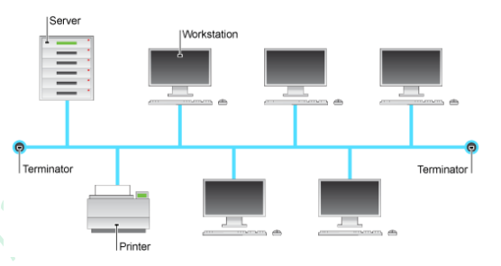

# 3.2 Communication and Internet technologies

3.2.1 Protocols
---------------

> - show understanding of why a protocol is essential for communication between computers
> - show understanding of how protocol implementation can be viewed as a stack, where each layer has its own functionality
> - show understanding of the function of each layer of the TCP/IP protocol suite
> - show understanding of the application of the TCP/IP protocol suite when a message is sent from one host to another on the Internet
> - show understanding of how the BitTorrent protocol provides peer-to-peer file sharing
> - show an awareness of other protocols (HTTP, FTP, POP3, SMTP) and their purposes

### Protocol layers
> s18 31 Q3.c \[3\]  
> w19 33 Q7   \[4\]

|    Layer    |    Protocol     |
|:-----------:|:---------------:|
|  Physical   |     Modems      |
|  Data link  | Ethernet / WiFi |
|   Network   |       IP        |
|  Transport  |    TCP / UDP    |
| Application |       FTP       |

Remember: DNTA

### Why protocols are essential for communicat ion between computers.
> w19 Q3 \[2\]

- Provides a set of standards for transmission of data
- ... that gives a known set of rules for transmitting and receiving data.
- This enables communication between devices
- ... from different platforms.

### Explain how the BitTorrent protocol allows files to be shared
> s18 Q3.c \[3\]

- BT client software made available
- A computer joins a swarm by using the software to load a BT descriptor file
- File is split into small pieces
- Once a computer has a piece it can become a seed and upload to other computers
- Pieces of file are both downloaded and uploaded
- A server 'tracker' keeps records of all computers in the swarm
- The server shares their IP addresses allowing them to connect to each other

### Describe the TCP/IP protocol suite
> w20 33 Q3 \[5\]
>
> - should say all the layers
> - layers should be in order

- A layered model
- ... with 4 layers
- Layers *(ordered)*:
  - Data Link, Network,
  - Transport, Application
- Uses a set of protocols for transmission of data

3.2.2 Circuit switching, packet switching and routers
-----------------------------------------------------

> - show understanding of circuit switching and where it is applicable
> - show understanding of packet switching 
> - show understanding of the function of a router in packet switching
> - explain how packet switching is used to pass messages across a network, including the Internet

### Items contained in an `IP` packet
> s18 32 Q5.d \[4\]

- Source address
- Destination address
- Sequence number
- Payload
- Data length

### `packet switching`

#### Describe `packet switching`
> w20 33 Q3 \[3\]

- File is divided into packets
- ... and necessary data added to each packet
- ... which are sent independently of each other
- ... and takes different routes.
- Packets are reassembled at the destination.
- Missing packets can be resent.

#### Benefits of using `packet switching`
> s18 32 Q4.d \[4\]

- **Alternative route available**
- **... in case of network problem**
- If packet fails to arrive
- ... only that packet has to be resent

#### Drawbacks of using `packet switching` for file transmission
> w20 33 Q3 \[1\]

- Packets can be delayed

#### Drawbacks of using `packet switching` for video conferencing
> s17 31 Q5.b \[2\]  
> Don't write ( )

- Picture and sound not synchronised *(Because packets may not arrive in order)*
- Interruptions
- Can be degraded by other competing traffic

### Explain the role of `router`s in sending an email using `packet switching`
> w15 31 Q3.b \[3\]

- Email has been split up into packets.
- Packet has destination address.
- Packets pass through different routers.
- Routers use IP addresses.

### Why sending an email message may use `packet switching`
> w15 31 Q3.c \[2\]  
> s20 33 Q3   \[2\]

> MS varies, write them all.

- **Packets arriving out of order is not an issue.**
- **Time delay due to packet lost is not significant / Real time communication is not required.**
- Sending packets by different routes is not an issue.
- No requirement for a continuous circuit.
- No requirement for full bandwidth.

### The purpose of a packet header
> w19 33 Q7 \[2\]

- To store data about packet
- ... to ensure that it reaches its destination
- ... and that message can be properly reconstructed.

### How `packet`, `router`, `TCP/IP` are used in requesting a web page
> s17 31 Q5.a \[2\]x3

#### `Packet`

*As MS varies, always write these 3:*

- **Both request and web page are split into packets** *(required by all MS)*
- Each packet is sent on different routes **from device to device**
- Client reassembles packets to rebuild web page

#### `Router`
- Transmits packets
- Contains connections to many other routers
- When packets arrive at router, router decides where next to send packet

#### `TCP/IP`
- Is the protocol
- Rules for communication between web server and browser

### `circuit switching`

#### Explain what is meant by `circuit switching`
> s17 31 Q5.b \[2\]  
> w15 32 Q3.a \[2\]
> s20 33 Q3   \[3\]

*Always write:*

- **Dedicated** communication channel **between the two communicating devices**
- ... which lasts for duration of connection.
- Established prior to start of communication.
- Removed when transmission completed.

#### How `circuit switching` overcome problems of `packet switching`
> s17 31 Q5.b \[3\]  
> w15 31 Q3.e \[3\]  
> w15 32 Q3.b \[3\]
> s20 33 Q3   \[2\]

*Always write:*

- **No lost of packets / No loss of synchronization.**
- **Dedicated circuit has full bandwidth.**
- In `circuit switching`, packets will arrive in order
- ... **so quality of service guaranteed**.
- No delay.
- Two-way real time conversation.

*If forgotten, write also:*

- In `packet switching`, packets may not arrive in order
- ... as packets can take different routes.

*Make full use of spaces writing basics on `packets` e.g. splitting, contains destination IP*

3.2.3 Local Area Networks (LAN)
-------------------------------

> - show understanding of a bus topology network and the implications of how packets are transmitted between two hosts
> - show understanding of a star topology network and the implications of how packets are transmitted between two hosts
> - show understanding of a wireless network
> - explain how hardware is used to support a LAN: switch, router, servers, Network Interface Cards (NICs), wireless access points
> - show understanding of Ethernet and how collision detection and avoidance (such as CSMA/CD) works

### Items stored in a routing table
> s18 32 Q5.d \[2\]

- IP address of network destination
- IP address of possible next hop
- Data to decide best route
- Interface

### `Bus topology`
> s16 31 Q1 \[2\]

- A line connecting all devices
- One *terminator* at each end

#### Benefits and drawbacks of using `bus topology`
> s18 31 Q3.a \[2\]

Benefits:

- Easier to set up
- Fewer cables required

Drawbacks:

- Collisions
- Security lower because several computers receive the data

#### How to handle `collision` in bus topology
> s16 31 Q1.c \[3\]

- Both stop transmitting
- Each uses a random time
- Wait for time period
- Check for bus status
- Attempt to re-transmit

### `Star topology`

#### Benefits and drawbacks of using `star topology`
> s18 31 Q3.a \[1\]  
> s19 33 Q2   \[4\]

Benefits:

- Secure
- ... since signals only go to destination.
- A new device can be easily added to the network
- ... as only one connection direct to server needs to set up.
- If one node or link fails
- ... the other computers can continue working.

Drawbacks:

- If central device fails then whole network goes down.
- Performance dependent on central device

### How `star topology` solves problem in `bus topology`
> s16 31 Q1.d \[4\]

> a switch is used.

- A switch has a number of **ports**
- Each connects to a single device
- Switch provides direct transmission from device to device
- Collisions are no longer possible
- *Question-specific examples*

### Describe CSMA/CD protocol
> s19 33 Q2 \[3\]

- Carrier Sense Multiple Access with Collision Detection.
- Before transmitting a device checks if the channel is busy.
- ... if so, the device waits.
- When transmission begins the device listens for other devices also beginning transmission.
- If there is a collision, transmission is aborted.
- Both devices wait a random time then try again.

### How `router` used to university LAN
> s19 33 Q2 \[2\]

- Allows internal connections between the university LANs.
- Allows external connections from the main LAN.

### How `NIC` used to university LAN
> s19 33 Q2 \[2\]

- Provides device with a MAC address
- ... to uniquely identify it on the network.
- Allows each individual device to connect to the network.

### How `wireless access point` used to university LAN
> s19 33 Q2 \[2\]

- Allowing devices to connect to the LAN via radio communication
- ... instead of using a cable.
- Easy to move device to different locations.

