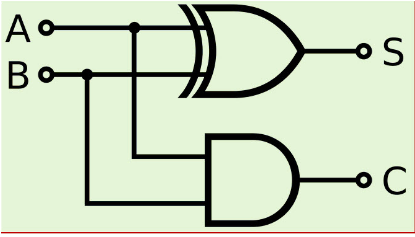
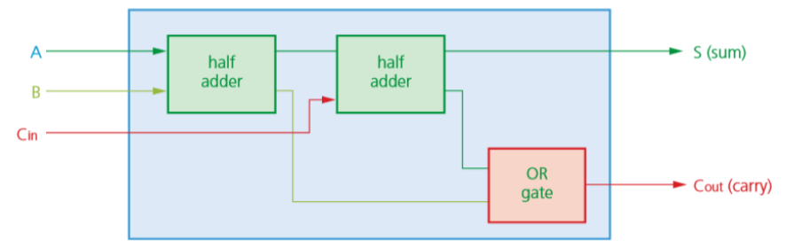

# 3.3 Hardware

3.3.1 Logic gates and circuit design
------------------------------------
> - produce truth tables for common logic circuit  including half adders and full adders
> - derive a truth table for a given logic circuit

### Labels of outputs of a Half adder
> w16 31 Q4.a.iii \[4\]

- `C`: Represents ***the carry part of the addition of two bits***
- `S`: Represents ***the sum part of the addition of two bits***

3.3.2 Boolean algebra
---------------------

> - show understanding of Boolean algebra
> - show understanding of De Morgan’s Laws
> - perform Boolean algebra using De Morgan’s Laws
> - simplify a logic circuit/expression using Boolean algebra

### Laws and Rules of Boolean Algebra

#### Absorption Law or Redundancy Law

- `X + X · Y = X`
- `X + (!X) · Y = X + Y`
- `(X + Y) · (X + z) = X + z · Y`

### DeMorgan's Theorem

- `!(A · B · C) = !A + !B + !C`
- `!(A + B + C) = !A · !B · !C`

### Half adder
> w16 33 Q4 \[7\]

#### Labeling the two results
> w16 33 Q4.a.iii \[4\]

- `C`: represents the *carry part of the addition of **two** bits*
- `S`: represents the *sum part of the addition of **two** bits*

### Full adder
> w16 32 Q5 \[7\]

#### Labeling the two results
> w16 32 Q5.a.iii \[4\]

- `C`: represents the *carry part of the addition of **three** bits*
- `S`: represents the *sum part of the addition of **three** bits*

3.3.3 Karnaugh Maps
-------------------

> - show understanding of Karnaugh Maps
> - show understanding of the benefits of using Karnaugh Maps
> - solve logic problems using Karnaugh Maps

> w15 32 Q5

3.3.4 Flip-flops
----------------

> - show understanding of how to construct a flip-flop (SR and JK)
> - describe the role of flip-flops as data storage elements

### How SR flip-flop be in an invalid state
> w17 31 Q5.b.ii \[2\]

- `Q` and `!Q` have the same value.
- `Q` and `!Q` should be complements of each other.
- Flip-flop becomes unstable.

### Why JK flip-flop is an improvement on the SR flip-flop
> w17 31 Q5.c.ii \[2\]

- SR flip-flop has an invalid state when `Q` and `!Q` have the same value.
- JK flip-flop synchronises the inputs so avoided such invalid state. (because inputs may not arrive at the same time)

### The role of flip-flops in a computer
> w17 31 Q5.d \[2\]

- Computers use bits to store data
- Flip-flops can be used to store bits
- ... to create memory.

3.3.5 RISC processors
---------------------

> - show understanding of the differences between RISC and CISC processors
> - show understanding of the importance/use of pipelining and registers in RISC processors
> - show understanding of interrupt handling on CISC and RISC processors

### What is meant by `pipelining`
> w17 32 Q2.b.i \[2\]

- Pipelining is instruction level parallelism.
- Execution of an instruction is split into a number of stages.
- Processing of a number of instructions can be concurrent.

### Compare RISC with CISC
> w18 32 Q5.a \[4\]

RISC:
- **fewer** and **simpler** instructions (\[2\])
- many registers
- a few instruction formats
- requires less complex circuits

3.3.6 Parallel processing
-------------------------

> - show awareness of the four basic computer architectures: SISD, SIMD, MISD, MIMD
> - show awareness of the characteristics of massively parallel computers

- `SISD`: Single Instruction Single Data
- `MIMD`: Multiple Instruction Multiple Data

### Massively parallel computer
> w15 32 Q4.b \[2\]

- `Massive`: large numbers of processors
- `Parallel`: to perform a set of coordinated computations simultaneously

### Issues with massively parallel computer
> w15 32 Q4.c \[4\]

#### **Hardware** \[2\]

- Processors need to be able to communicate
- so that processed data can be transferred from one processor to another

#### **Software** \[2\]

- Suitable algorithms
- that allows data to be processed by multiple processors simultaneously
