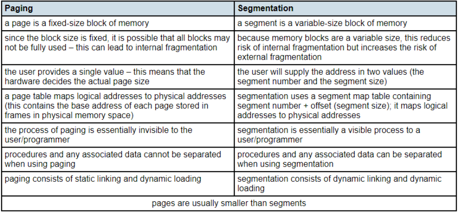

# 3.4 System Software

3.4.1 Purposes of an operating system (OS)
------------------------------------------
> - show understanding of how an OS can maximise the use of resources
> - describe the ways in which the user interface hides the complexities of the hardware from the user
> - show understanding of processor management: multitasking, including:
>   - the concept of multitasking and a process
>   - the process states: running, ready and blocked
>   - the need for scheduling
>   - the concept of an interrupt
>   - how the kernel of the OS acts as the interrupt handler and how interrupt handling is used to manage low-level scheduling
> - show understanding of paging for memory management: including:
>   - the concepts of paging and virtual memory
>   - the need for paging
>   - how pages can be replaced
>   - how disk thrashing can occur

### Paging
> w16 31 Q3

> 

### Difference between process and program
> w15 31 Q6.a \[2\]

- A process is the executing code ('dynamic')
- A program is the written code ('static')

### Causes of changing states of processes
> w15 31 Q6.b \[6\]

#### RUNNING -> READY
- Running: Process is allocated time on processor
- Ready: When interrupts occur the process can no longer use processor even though it is capable of further processing

#### READY -> RUNNING
- Process is capable of using processor
- OS allocates processor to process so that process can execute

#### RUNNING -> BLOCKED
- When an executing process needs to perform IO operation, **it is placed in blocked state until IO operation completed**.

### Why a process cannot be moved from the BLOCKING state to READY state
> w15 31 Q6.c \[3\]

- When IO operation completed for process in blocking state,
- process is put in ready state
- OS decides which process to allocate to processor from the ready queue.

### The role of high-level scheduler in a multiprogramming OS
> w15 31 Q6.d \[2\]

- Decides which processes are to be loaded from the backing store
- into ready queue

### The role of low-level scheduler in a multiprogramming OS
> w15 32 Q6.d \[2\]

- Decides which of the processes in ready state
- that should get use of processor
- based on priority
- invoked after interrupt

### How interrupts help to solve unloaded paging problems
> w16 32 Q3.b.ii \[3\]

- When loading an instruction for a page not in memory,
- ... a page fault occurs,
- ... which generates an interrupt.
- ISR code is executed, causes the OS to load the paged needed into memory

### Page Thrashing
> w16 32 Q3.iv \[1\]

(Need only to remember the name 'Thrashing' but not definition)  
Thrashing: When pages are loaded and unloaded simultaneously.

3.4.2 Virtual Machine
---------------------
> - show understanding of the concept of a virtual machine
> - give examples of the role of virtual machines
> - show understanding of the benefits and limitations of virtual machines

### Limitations of testing using VM
> s16 31 Q3.b.ii \[2\]

- Particular hardware may be difficult to emulate
- Problems in judging actual response times

3.4.3 Translation software
--------------------------
> - show understanding of how an interpreter can execute programs without producing a translated version
> - show understanding of the various stages in the compilation of a program: lexical analysis, syntax analysis, code generation and optimisation
> - show understanding of how the grammar of a language can be expressed using syntax diagrams or Backus-Naur Form (BNF) notation
> - show understanding of how Reverse Polish Notation (RPN) can be used to carry out the evaluation of expressions

### The benefit of code optimization
> w15 33 Q3 \[2\]

- Less instructions
- so less execution time needed

### The benefit of (Reverse Polish Notation) RPN
> w16 31 Q3.c.iii \[2\]

- No need for rules of precedence
- No need for brackets
- In RPN evaluation of operations is always left to right

### Phases of a Compiler

1. Lexical analyzer
2. Syntax analyzer
3. Semantic analyzer
4. Intermediate code generator
5. Code optimizer
6. Code generator

#### Tasks of Syntax analysis
> w15 32 Q2.c.ii \[2\]

- construct parse tree
- checks syntax
- reports error
