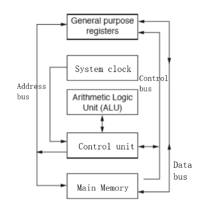

# Processor Fundamentals

## Buses
> Exam:
> - 直接填写 `bus width`, `clock speed` 等作用和对性能的影响
> - 直接填写各 `bus` 的作用
> - 看表格填写各 `bus` 间的联系

- `Address bus`: transmits an address between the processor and memory. **(One way)**
- `Data bus`: carries data between the processor and memory. (Two way)
- `Control Bus`: transmits signals between the control unit and the other components. (Two way)

`Bus width`: **determines the no. of bits that can be simultaneously transferred** \[1\]

Greater bus width, **significant increase in the number of directly addressed memory locations** \[1\]

`Clock speed`: (MHz/GHz) **the no. of cycles that are performed by the CPU per second.** \[1\]

> Faster clock speed means more operations executed per unit of time \[1\]  
> however faster clock speed causes processor to heat up \[1\]

`Clock tick` = `Clock cycle`

`Clock rate:` (MHz/GHz) the speed at which a micro-processor execute instructions

## Registers

| Abbr. | Full Name                    | Function                                                                                                          |
|:------|:-----------------------------|:------------------------------------------------------------------------------------------------------------------|
| MAR   | Memory address register      | stores the address of location for read/write operation                                                           |
| MDR   | Memory data register         | stores the data involved in read/write operation                                                                  |
| PC    | Program counter              | contains the location of the instruction that is to be executed next.                                             |
| ACC   | Accumulator                  | (single general-purpose register) stores the result of arithmetic and logic operations performed by the processor |
| CIR   | Current instruction register | holds the instruction that is to be executed                                                                      |

#### Benefits of using USB \[2\]
- It's nearly impossible to wrongly connect a device
- supported by many operating systems
- automatically detected and configures when attached
- has became a industrial standard

#### How to read content

1. MAR -> address
2. Read signal is sent by processor to memory
3. content -> MDR

#### How to write content

1. content -> MDR
2. address -> MAR
3. Write signal sent by processor to memory
4. Content is changed