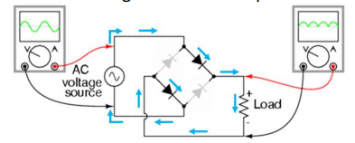

# Table of contents

- [Electric Fields](#electric-fields)
  - [Why electric field causes the air to become conducting \[3\]](#why-electric-field-causes-the-air-to-become-conducting-3)
  - [The significance of the Millikan experiment \[1\]](#the-significance-of-the-millikan-experiment-1)
  - [Define `electric field strength` \[1\]](#define-electric-field-strength-1)
  - [What is meant by a line of force in an electric field \[2\]](#what-is-meant-by-a-line-of-force-in-an-electric-field-2)
  - [What is meant by `potential energy` of a body \[2\]](#what-is-meant-by-potential-energy-of-a-body-2)
  - [State `Coulomb's law` \[2\]](#state-coulombs-law-2)
- [Electromagnetism](#electromagnetism)
  - [What is meant by a `magnetic field` \[2\]](#what-is-meant-by-a-magnetic-field-2)
  - [State `Newton's third law of motion` \[1\]](#state-newtons-third-law-of-motion-1)
  - [State `Faraday's law of electromagnetic induction` \[2\]](#state-faradays-law-of-electromagnetic-induction-2)
  - [State `Lenz's law` \[2\]](#state-lenzs-law-2)
  - [Define `magnetic flux density` \[3\]](#define-magnetic-flux-density-3)
  - [What is meant by the `magnetic flux linkage` of a coil \[3\]](#what-is-meant-by-the-magnetic-flux-linkage-of-a-coil-3)
  - [Why eddy currents are induced in the metal disc \[2\]](#why-eddy-currents-are-induced-in-the-metal-disc-2)
  - [Define `tesla` \[3\]](#define-tesla-3)
  - [What is meant by `electric potential` at a point \[2\]](#what-is-meant-by-electric-potential-at-a-point-2)
  - [Why Hall Voltage varies between a maximum positive value and a maximum negative value when rotating Hall probe \[3\]](#why-hall-voltage-varies-between-a-maximum-positive-value-and-a-maximum-negative-value-when-rotating-hall-probe-3)
  - [Why induced e.m.f. alternating \[2\]](#why-induced-emf-alternating-2)
- [Capacitance](#capacitance)
  - [Define `capacitance` \[2\]](#define-capacitance-2)
  - [Why capacitors store energy but no resultant charge \[3\]](#why-capacitors-store-energy-but-no-resultant-charge-3)
  - [Why `Q = CV` is not applicable to a plastic sphere \[3\]](#why-q--cv-is-not-applicable-to-a-plastic-sphere-3)
  - [Functionality of capacitors \[2\]](#functionality-of-capacitors-2)
  - [Combining capacitors](#combining-capacitors)
- [Alternating current](#alternating-current)
  - [What is meant by `root-mean-square`(`r.m.s`) value of an alternating current \[3\]](#what-is-meant-by-root-mean-squarerms-value-of-an-alternating-current-3)
  - [What is meant by `smoothing` \[1\]](#what-is-meant-by-smoothing-1)
  - [The effect of value of the capacitance of the smoothing capacitor in relation to smoothing \[2\]](#the-effect-of-value-of-the-capacitance-of-the-smoothing-capacitor-in-relation-to-smoothing-2)
  - [Why alternating current in the primary coil is not in phase with the alternating e.m.f induced in the secondary coil \[3\]](#why-alternating-current-in-the-primary-coil-is-not-in-phase-with-the-alternating-emf-induced-in-the-secondary-coil-3)
  - [Why the coils are wound on a core made of iron \[1\]](#why-the-coils-are-wound-on-a-core-made-of-iron-1)
  - [Why the iron core is laminated \[2\]](#why-the-iron-core-is-laminated-2)
  - [What is meant by an ideal transformer \[1\]](#what-is-meant-by-an-ideal-transformer-1)
  - [Why thermal energy is generated in the core \[2\]](#why-thermal-energy-is-generated-in-the-core-2)
  - [Why the p.d. across the load and the e.m.f. of the supply are not in phase \[2\]](#why-the-pd-across-the-load-and-the-emf-of-the-supply-are-not-in-phase-2)
- [Direct Sensing](#direct-sensing)
  - [Calculating gain](#calculating-gain)
  - [State properties of an `ideal operational amplifier` \[4\]](#state-properties-of-an-ideal-operational-amplifier-4)
  - [What is meant by `negative feedback` \[2\]](#what-is-meant-by-negative-feedback-2)
  - [State two effects of negative feedback on the gain of an amplifier \[2\]](#state-two-effects-of-negative-feedback-on-the-gain-of-an-amplifier-2)
  - [What is meant by `virtual earth` \[3\]](#what-is-meant-by-virtual-earth-3)
  - [State two effects of negative feedback on an amplifier incorporating an op-amp \[2\]](#state-two-effects-of-negative-feedback-on-an-amplifier-incorporating-an-op-amp-2)
  - [State the function of a comparator \[2\]](#state-the-function-of-a-comparator-2)


Electric Fields
---------------

|          Quantity           |                                Formulae                                 |
|:---------------------------:|:-----------------------------------------------------------------------:|
|  `Electric Field Strength`  |      |
|    `Electric Potential`     |                  |
| `Electric Potential Energy` |  |
|      `Electric Force`       |                          |

`ε0`: *permittivity of free space*

### Why electric field causes the air to become conducting \[3\]
- Field causes forces on the electrons and nucleus **in opposite directions**. \[2\]
- Electrons stripped off the atom.

### The significance of the Millikan experiment \[1\]
- Charge is quantised.

### Define `electric field strength` \[1\]
- *Force per unit positive charge*

### What is meant by a line of force in an electric field \[2\]
- Tangent to line gives direction of force on a unit **positive** test charge.

### What is meant by `potential energy` of a body \[2\]
- *Ability to do work*
- ... *as a result of the position of an object*

### State `Coulomb's law` \[2\]
- Force proportional to product of two charges and inversely proportional to square of separation.
- *(reference to point charges)*

Electromagnetism
----------------

### What is meant by a `magnetic field` \[2\]
- Region of space where there is a force
- ... acting on moving charge.

### State `Newton's third law of motion` \[1\]

- *When two bodies interact, force on one body is equal but opposite in direction to force on the other body.*

### State `Faraday's law of electromagnetic induction` \[2\]
- *Induced e.m.f. is proportional to rate of change of*
- ... **magnetic flux linkage**.

### State `Lenz's law` \[2\]
- Induced e.m.f. acts in such a direction ***to produce effects***
- to oppose the change causing it

### Define `magnetic flux density` \[3\]
> w18 42 Q8

- force per unit length
- ... on straight conductor carrying unit current
- ... normal to the field.

### What is meant by the `magnetic flux linkage` of a coil \[3\]
> s18 42 Q9

- **magnetic flux density** × ***cross-sectional*** area
- ... × number of turns of the coil

### Why induced e.m.f. alternating \[2\]
- (Lenz) e.m.f. opposes change causing it.
- As direction of movement changes, so does e.m.f.

### Why eddy currents are induced in the metal disc \[2\]
- Field in disc not uniform
- ... so different e.m.f. in different parts of disc
- ... lead to eddy currents.

### Define `tesla` \[3\]
- Flux normal to long straight wire carrying a current of 1A
- ... creates force per unit length of 1 N/m.

### What is meant by `electric potential` at a point \[2\]
- Work done in moving unit positive charge
- ... from infinity *to the point*.

### Talking about `Hall probe`

Always link the formula for `VH`.

#### Why a Hall probe is made from a thin slice of material \[2\]
> s17 42 Q9

- Hall voltage depends on thickness of slice.
- Sinner slice, larger voltage.

#### Why current in Hall probe must be constant to measure magnetic flux density \[1\]
> s17 42 Q9

- Hall voltage depends on current in slice.

#### Why Hall Voltage varies between a maximum positive value and a maximum negative value when rotating Hall probe \[3\]
- `VH` depends on **the sine of** angle between (plane of) probe and B-field.

Capacitance
-----------

### Define `capacitance` \[2\]

- `C = Q/V`
- Ratio of charge and its potential.

### Why capacitors store energy but no resultant charge \[3\]
> It's suggested to remember and write them all as questions varies.

- Charge on plates are equal and opposite,
- ... so no resultant charge.
- On a capacitor, there's charge separation.
- To separate charges, work must be done.

### Why `Q = CV` is not applicable to a plastic sphere \[3\]
- Plastic is an insulator
- ..., charges don't move
- ..., so charge can't be considered at the centre.

### Functionality of capacitors \[2\]
- Store energy.
- Block direct current.
- *Smoothing*.

### Combining capacitors

- Parallel: C1 + C2
- Serial:
  ```latex
    \frac{1}{\frac{1}{C_1}+\frac{1}{C_2}}  
  ```

Alternating current
-------------------

Basics:

- Number of turns is proportional to e.m.f.
- 

### What is meant by `root-mean-square`(`r.m.s`) value of an alternating current \[3\]

> Always write these 3 points.

- The value of the direct current
- ... that dissipates energy *in a resistor*
- ... at the same rate

### What is meant by `smoothing` \[1\]
- Reduction in the variation of the output voltage.
- *or* Output voltage does not fall to zero.

### The effect of value of the capacitance of the smoothing capacitor in relation to smoothing \[2\]

- Larger capacitance produces more smoothing
- ... for the same load.

### Why the coils are wound on a core made of iron \[1\]
- *To prevent flux losses*

### Why the iron core is laminated \[2\]
- To reduce power loss in the core
- ... due to eddy currents.

### What is meant by an ideal transformer \[1\]
- no power loss in transformer

### Why thermal energy is generated in the core \[2\]
- *Changing flux induces current in the core*
- ..., *causing heating effect*

### Why alternating current in the primary coil is not in phase with the alternating e.m.f induced in the secondary coil \[3\]
- Flux in core is in phase with current in the primary coil
- Secondary coil cuts flux so induced e.m.f.
- Flux and rate of change of flux not in phase

### Why the p.d. across the load and the e.m.f. of the supply are not in phase \[2\]
- Magnetic flux in phase with e.m.f. in primary coil.
- e.m.f. across secondary coil is proportional to the rate of change of flux.

### Why output p.d. of a transformer is alternating \[3\]
> s20 42 Q10

- e.m.f. varies as rate of change of flux changes.
- Direction of e.m.f. changes when direction of change of flux reverses.
- Flux is continuously increasing and decreasing.

Direct Sensing
--------------

### State properties of an `ideal operational amplifier` \[4\]
- Infinite gain
- Infinite input impedance
- Zero output impedance
- Infinite bandwidth

### What is meant by `negative feedback` \[2\]
> s18 42 Q7

- Output is combined with the input
- Output is ***subtracted*** from input

### State two effects of negative feedback on the gain of an amplifier \[2\]
> s18 42 Q7

- Smaller gain
- Greater bandwidth

### What is meant by `virtual earth` \[3\]
> s20 42 Q8

- Infinite gain.
- Feedback loop ensures `V+ ≈ V-` (any difference between `V+` and `V-` results in saturated output)
- Non-inverting input is earthed.

### State two effects of negative feedback on an amplifier incorporating an op-amp \[2\]
- Reduces gain
- Increases bandwidth
- Greater stability

### State the function of a comparator \[2\]
- To compare two potentials.
- Output depends upon which is greater.

### Calculating gain
> s18 42 Q7
> s20 42 Q8

```math
G = \frac{V_{out}}{V_{in}}
 ```

- normal amplifier
  ```math
  G = \frac{R_{out}}{R_{in}}
   ```

- *non-inverting* amplifier
  ```math
  G = \frac{R_{out}}{R_{in}} + 1 
   ```

- *inverting* amplifier
  ```math
  G = -\frac{R_{out}}{R_{in}}
   ```