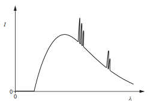

# Table of contents

- [Quantum Physics](#quantum-physics)
  - [State what is meant by `work function energy` \[1\]](#state-what-is-meant-by-work-function-energy-1)
  - [State what is meant by the `threshold frequency` \[2\]](#state-what-is-meant-by-the-threshold-frequency-2)
  - [State what is meant by `infinite bandwidth` \[1\]](#state-what-is-meant-by-infinite-bandwidth-1)
  - [State what is meant by `infinite slew rate` \[1\]](#state-what-is-meant-by-infinite-slew-rate-1)
  - [What is meant by the `de Broglie wavelength` \[2\]](#what-is-meant-by-the-de-broglie-wavelength-2)
  - [State the de Broglie relation \[2\]](#state-the-de-broglie-relation-2)
  - [State what is meant by a `photon` \[3\]](#state-what-is-meant-by-a-photon-3)
  - [Describe an experiment to demonstrate the wave nature of electrons \[5\]](#describe-an-experiment-to-demonstrate-the-wave-nature-of-electrons-5)
  - [State experimental observations that support the particle nature of electromagnetic radiation \[3\]](#state-experimental-observations-that-support-the-particle-nature-of-electromagnetic-radiation-3)
  - [Explain how the line spectrum of hydrogen provides evidence for the existence of discrete electron energy levels in atoms. \[3\]](#explain-how-the-line-spectrum-of-hydrogen-provides-evidence-for-the-existence-of-discrete-electron-energy-levels-in-atoms-3)
  - [Explain why threshold frequency and short emission time provide evidence for the particulate nature of e.m. radiation, as opposed to wave theory \[4\]](#explain-why-threshold-frequency-and-short-emission-time-provide-evidence-for-the-particulate-nature-of-em-radiation-as-opposed-to-wave-theory-4)
  - [Describe the appearance of a visible line emission spectrum \[2\]](#describe-the-appearance-of-a-visible-line-emission-spectrum-2)
  - [Use band theory to explain why the resistance of semiconductor increases as temperature increases \[4\]](#use-band-theory-to-explain-why-the-resistance-of-semiconductor-decreases-as-temperature-increases-4)
  - [Why a continuous distribution of wavelengths in emission spectrum \[3\]](#why-a-continuous-distribution-of-wavelengths-in-emission-spectrum-3)
  - [Why narrow peaks of increased intensity at certain wavelengths in emission spectrum \[3\]](#why-narrow-peaks-of-increased-intensity-at-certain-wavelengths-in-emission-spectrum-3)
  - [Describe the appearance of the spectrum of the absorption](#describe-the-appearance-of-the-spectrum-of-the-absorption)
  - [Explain how the energy band is produced](#explain-how-the-energy-band-is-produced)
  - [Why LDR's resistance decreases as light intensity increases](#why-ldrs-resistance-decreases-as-light-intensity-increases)
- [Nuclear Physics](#nuclear-physics)
  - [Describe the photoelectric effect \[2\]](#describe-the-photoelectric-effect-2)
  - [State what is meant by the `binding energy` of a nucleus \[2\]](#state-what-is-meant-by-the-binding-energy-of-a-nucleus-2)
  - [State what is meant by `nuclear fission` \[2\]](#state-what-is-meant-by-nuclear-fission-2)
  - [State what is meant by `nuclear fusion` \[1\]](#state-what-is-meant-by-nuclear-fusion-1)
  - [What is meant by `random decay` \[1\]](#what-is-meant-by-random-decay-1)
  - [What is meant by `radioactive decay` \[2\]](#what-is-meant-by-radioactive-decay-2)
  - [Define the `decay constant` of a radioactive isotope \[2\]](#define-the-decay-constant-of-a-radioactive-isotope-2)
  - [Define radioactive `half-life` \[2\]](#define-radioactive-half-life-2)
  - [Calculating binding energy \[4\]](#calculating-binding-energy-4)
  - [Why the activity and measured count rate may be different?](#why-the-activity-and-measured-count-rate-may-be-different)
- [Ideal Gases](#ideal-gases)
  - [What is meant by symbol `<c²>` \[2\]](#what-is-meant-by-symbol-c-2)
  - [State the meaning of the symbol `<c²>` \[1\]](#state-the-meaning-of-the-symbol-c-1)
  - [State what is meant by an `ideal gas` \[2\]](#state-what-is-meant-by-an-ideal-gas-2)
  - [State two conditions for `pV=constant × T` to be valid \[2\]](#state-two-conditions-for-pvconstant--t-to-be-valid-2)
  - [State `Avogadro’s constant` \[2\]](#state-avogadros-constant-2)
  - [State what is meant by a `mole` \[2\]](#state-what-is-meant-by-a-mole-2)
  - [How molecular movement causes the pressure exerted by a gas \[3\]](#how-molecular-movement-causes-the-pressure-exerted-by-a-gas-3)
  - [State the basic assumptions of the kinetic theory of gases \[4\]](#state-the-basic-assumptions-of-the-kinetic-theory-of-gases-4)
- [Thermal Physics](#thermal-physics)
  - [What is meant by `internal energy` of a system \[2\]](#what-is-meant-by-internal-energy-of-a-system-2)
  - [Why absolute scale of temperature differs from other temperature scales \[1\]](#why-absolute-scale-of-temperature-differs-from-other-temperature-scales-1)
  - [What is meant by `absolute zero` of temperature \[1\]](#what-is-meant-by-absolute-zero-of-temperature-1)
  - [What is meant by `specific latent heat` \[3\]](#what-is-meant-by-specific-latent-heat-3)
  - [Define `specific latent heat of fusion` \[2\]](#define-specific-latent-heat-of-fusion-2)
  - [Why melting requires energy but there is no change in temperature \[3\]](#why-melting-requires-energy-but-there-is-no-change-in-temperature-3)
  - [Two processes for which thermal energy is required during boiling \[2\]](#two-processes-for-which-thermal-energy-is-required-during-boiling-2)
  - [`The first law of thermodynamics` \[3\]](#the-first-law-of-thermodynamics-3)
  - [Observations that show why temperature does not measure the amount of heat \[4\]](#observations-that-show-why-temperature-does-not-measure-the-amount-of-heat-4)


Quantum Physics
---------------

### State what is meant by `work function energy` \[2\]
> m20 42 Q10

- ***Minimum*** energy of photon required to remove an electron
- ... from surface.

### State what is meant by the `threshold frequency` \[2\]
- Minimum frequency for electron to be emitted
- of electromagnetic radiation.

### State what is meant by `infinite bandwidth` \[1\]
> w20 Q8 \[1\]  
> m18 42 Q8 \[1\]

- Gain is the same for all frequencies.

### State what is meant by `infinite slew rate` \[1\]
> w20 Q8 \[1\]  
> m18 42 Q8 \[1\]

- No time delay in change in output when input is changed.

### What is meant by the `de Broglie wavelength` \[2\]
- wavelength of wave associated with a particle
- ..., that is moving.

### State the de Broglie relation \[2\]
- `λ = h / p`,
- explain λ, h, p.

### State what is meant by a `photon` \[3\]
> Write all the 3 points.

- Photon is discrete amount of energy
- ... of an electromagnetic radiation.
- energy = hf

### Describe an experiment to demonstrate the wave nature of electrons \[5\]
- Electron beam in a vacuum
- incident on carbon *film*.
- fluorescent screen
- pattern of concentric rings observed
- similar to diffraction pattern observed with visible light

### State experimental observations that support the particle nature of electromagnetic radiation \[3\]
> w20 42 Q11 \[2\]
> s17 42 Q10 \[2\]

- Maximum k.e. independent of intensity
- Maximum k.e. dependent (not proportional) on frequency
- Instantaneous emission
- Threshold frequency

### Explain how the line spectrum of hydrogen provides evidence for the existence of discrete electron energy levels in atoms. \[3\]
- Each line represents photon of specific energy.
- Photon emitted s a result of energy change of electron
- Specific energy changes so discrete levels.

### Explain why threshold frequency and short emission time provide evidence for the particulate nature of e.m. radiation, as opposed to wave theory \[4\]
> Write all the 5 points.

- *For a wave, electron can collect energy continuously.*
- *Wave theory predicts any frequency would give rise to emission of electron*
- ... *if exposure time is sufficiently long*.
- Photon has specific value of energy dependent on frequency.
- Emission if energy greater than threshold energy to remove electron from surface.

### Describe the appearance of a visible line emission spectrum \[2\]
> w18 42 Q11

- Mostly dark
- Coloured lines

### Use band theory to explain why the resistance of semiconductor decreases as temperature increases \[4\]
> w19 42 Q10 \[4\]  
> s19 42 Q7 \[5\]

> Write all of them.

- Electron in valence band gain energy.
- Electrons jump to conduction band.
- Holes are left in the valence band.
- *Both holes and electrons act as charge carriers.*
- Increased number of charge carriers cause lower resistance.

### Use band theory to explain why the resistance of copper wire increases as temperature increases \[4\]
> s20 42 Q11 \[4\]  
> m18 42 Q11 \[4\]

- **Conduction band and valence band overlap.** */ No forbidden band.*
- Number of charge carriers does not vary.
- Increase in temperature gives rise to increased lattice vibrations.
- Lattice vibrations hinder movement of charge carriers so resistance increases.

### Use concept of to explain the existence of the dark lines in emission spectrum of cool gas incident with white light \[4\]
> s20 43 Q10

- Electron gain energy from photon.
- Energy of photon is equal to difference in energy levels.
- Electron moves to higher energy level.
- Electron de-excites and emits photon
- ... in all directions.

### Why a continuous distribution of wavelengths in emission spectrum \[3\]
> w20 Q7 \[3\]



- X-ray photon produced when electron is decelerated.
- Larger acceleration results in larger photon energy.
- Continuous range of accelerations so continuous spectrum of wavelengths.

### Why narrow peaks of increased intensity at certain wavelengths in emission spectrum \[3\]
> w20 Q7 \[3\]

- Electron in target atom is excited.
- Electron de-excites causing emission of a photon.
- Discrete energy levels so discrete photon wavelengths.

### Describe the appearance of the spectrum of the absorption
- Electrons in cold gas molecules interact with photons.
- Photon energy causes electrons to move to higher energy level.
- Photon's energy equals to the difference of energy level.
- Photons re-emitted in all directions.

### Explain how the energy band is produced
- Atoms in solids are close together, electrons from one atom interact with those of neighbouring atoms,
- this change their electron energy levels, causing a spread of energy level into a band.

### Why LDR's resistance decreases as light intensity increases
- In darkness, conduction band isempty, so high resistance,
- In daylight, electrons in valence absorb photons, jump into conduction band, leaving holes in valence band
- More charge carriers, so resistance decreases.


Nuclear Physics
---------------

*Hints*

- For calculations involving decay, consider `A=λN` (not provided) and `A=A0 e^(-λt)` (provided).

### Describe the photoelectric effect \[2\]
> s18 42 Q10

- Emission of electrons
- ... when electromagnetic radiation incident on surface.

### State what is meant by the `binding energy` of a nucleus \[2\]
- Energy required to separate nucleons **in a nucleus**
- ... to infinity.

### Why binding energy per nucleon of U-235 is smaller than that of La-139 \[3\]
> s17 42 Q12

- When A > 56, binding energy per nucleon decreases as A increases.
- U-235 has larger nucleon number,
- ... so less.

### State what is meant by `nuclear fission` \[2\]
- Heavy nucleus breaks up
- ... into two nuclei of approximately equal mass.

### State what is meant by `nuclear fusion` \[1\]
- Light nuclei combine t o form heavier nuclei.

### What is meant by `random decay` \[1\]
> w19 42 Q12

- decay is **unpredictable**

### What is meant by `spontaneous` and `random` in `decay` \[2\]
> s20 43 Q12

**spontaneous:**
- decay is not affected by environment

**random:**
- time at which a nucleus will decay is not predictable.

### What is meant by `radioactive decay` \[2\]
> s18 42 Q10

- ***Spontaneous*** emission of particles by **unstable nucleus**.

### Define the `decay constant` of a radioactive isotope \[2\]
> w19 42 Q12

- Probability of decay *of a nucleus*
- ... **per unit time**.

### Define radioactive `half-life` \[2\]
- Time for number of atoms
- ... to be reduced to one half

### Calculating binding energy \[4\]
> s19 42 Q12 \[4\]

- Calculate mass defect
- `E=mc²`

### Why actual activity not the same with calculated \[2\]
> s20 43 Q12 \[2\]

- Additional source of activity.
- Emission from daughter products.

### Why a nucleus of helium-4 does not spontaneously break down to become nuclei of hydrogen \[2\]
> s20 42 Q12

- Amount of energy released in forming hydrogen isotopes
- ... is less than energy required to break apart helium nucleus.

*or*

- Binding energy per nucleon of helium is much greater,
- so would require a large amount of energy to separate nucleons in helium.

### What is meant by `mass defect` of a nucleus \[2\]
> s20 42 Q12

- Difference between mass of nucleus and mass of nucleons where nucleons are separated to infinity.

Ideal Gases
-----------


### State what is meant by an `ideal gas` \[2\]
- Obeys the law `pV=nRT`
- ... at all values of `p`, `V` and `T`.

*If \[3\], write also:*

- `p` - pressure
- `V` - volume
- `T` - temperature

### r.m.s. equation \[4\]
> s20 42 Q2

```
p = (1/3)ρ<c²>
```

Explain how terms are derived:
- `ρ`: NM/V *(from PV=nRT)*
- `1/3`: molecules move ini 3 directions

### What is meant by symbol `<c²>` \[2\]
- Mean value of the square
- ... of the speeds of the particles.

### State the meaning of the symbol `<c²>` \[1\]
- **mean square speed**

### State two conditions for `pV=constant × T` to be valid \[2\]
- Fixed mass of gas
- Ideal gas

### State `Avogadro’s constant` \[2\]
- Number of atoms of carbon-12
- ... in 0.012 kg of carbon-12.

### State what is meant by a `mole` \[2\]
- Amount of substance
- ... containing same number of particles as in 0.012 kg of carbon-12.

### How molecular movement causes the pressure exerted by a gas \[3\]
> m20 42 Q2

- **Molecules rebound from wall of vessel.**
- **Change in momentum gives rise to impulse.**
- *Forces on molecule so force on wall.*
- **Many impulses averaged to give constant force.**


### State the basic assumptions of the kinetic theory of gases \[4\]
*Hint: sphere, volume, random motion, inter-collision, inter-force*

- Molecules behave as elastic spheres.
- Volume of molecules is negligible compared to the volume of the containing vessel.
- Molecules are in random motion.
- Time of collision is negligible to time between collisions.
- No forces of attraction or repulsion between molecules.

Thermal Physics
---------------

### What is meant by `internal energy` of a system \[2\]
- sum of potential energy and **random** kinetic energy of atoms

### Why absolute scale of temperature differs from other temperature scales \[1\]
- it does not depend on the property of a substance

### What is meant by `absolute zero` of temperature \[1\]
- temperature at which atoms have minimum energy

### What is meant by `specific latent heat` \[3\]
- thermal energy required to change the state of a substance
- ... per unit mass
- ... without change in temperature

### Define `specific latent heat of fusion` \[2\]
> w18 42 Q2

- Thermal energy required to convert unit mass of solid to liquid
- ... without change in temperature

### Why melting requires energy but there is no change in temperature \[3\]
> s18 42 Q1

- On melting, bonds between molecules are broken,
- **potential energy increased**,
- kinetic energy unchanged so no temperature change.

### Two processes for which thermal energy is required during boiling \[2\]
- increasing separation of molecules
- doing work against atmosphere

### `The first law of thermodynamics` \[3\]
`△U = q + W`

- `△U`: increase in internal energy
- `q`: heat supplied to the system
- `w`: work down on the system

### Observations that show why temperature does not measure the amount of heat \[4\]

- - Two objects of different masses at same temperature
  - ... would have different amount of heat
- - When substance melts
  - ... heat input but no temperature change
- - Temperature shows direction of heat transfer
  - ... from high to low regardless of objects

