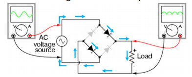
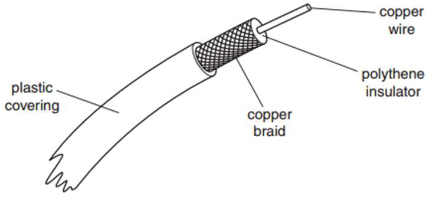

# A2 Terms & Definitions

# Table of contents

<!--
https://luciopaiva.com/markdown-toc/
-->

- [Circular Motion](#circular-motion)
  - [Define `radian` \[2\]](#define-radian-2)
  - [What is meant by `angular velocity` \[2\]](#what-is-meant-by-angular-velocity-2)
- [Gravitation](#gravitation)
  - [Define `gravitational potential` at a point \[2\]](#define-gravitational-potential-at-a-point-2)
  - [What is meant by a `gravitational field` \[2\]](#what-is-meant-by-a-gravitational-field-2)
  - [State `Newton's law of gravitation` \[2\] / \[3\]](#state-newtons-law-of-gravitation-2--3)
- [Electric Fields](#electric-fields)
  - [Why electric field causes the air to become conducting \[3\]](#why-electric-field-causes-the-air-to-become-conducting-3)
  - [The significance of the Millikan experiment \[1\]](#the-significance-of-the-millikan-experiment-1)
  - [Define `electric field strength` \[1\]](#define-electric-field-strength-1)
  - [What is meant by a line of force in an electric field \[2\]](#what-is-meant-by-a-line-of-force-in-an-electric-field-2)
  - [What is meant by `potential energy` of a body \[2\]](#what-is-meant-by-potential-energy-of-a-body-2)
  - [State `Coulomb's law` \[2\]](#state-coulombs-law-2)
- [Electromagnetism](#electromagnetism)
  - [What is meant by a `magnetic field` \[2\]](#what-is-meant-by-a-magnetic-field-2)
  - [State `Newton's third law of motion` \[1\]](#state-newtons-third-law-of-motion-1)
  - [State `Faraday's law of electromagnetic induction` \[2\]](#state-faradays-law-of-electromagnetic-induction-2)
  - [State `Lenz's law` \[2\]](#state-lenzs-law-2)
  - [Define `magnetic flux density` \[3\]](#define-magnetic-flux-density-3)
  - [Why eddy currents are induced in the metal disc \[2\]](#why-eddy-currents-are-induced-in-the-metal-disc-2)
  - [Define `tesla` \[3\]](#define-tesla-3)
  - [What is meant by `electric potential` at a point \[2\]](#what-is-meant-by-electric-potential-at-a-point-2)
  - [Why Hall Voltage varies between a maximum positive value and a maximum negative value when rotating Hall probe \[3\]](#why-hall-voltage-varies-between-a-maximum-positive-value-and-a-maximum-negative-value-when-rotating-hall-probe-3)
  - [Why induced e.m.f. alternating \[2\]](#why-induced-emf-alternating-2)
- [Capacitance](#capacitance)
  - [Define `capacitance` \[2\]](#define-capacitance-2)
  - [Why capacitors store energy but no resultant charge \[3\]](#why-capacitors-store-energy-but-no-resultant-charge-3)
  - [Why `Q = CV` is not applicable to a plastic sphere \[3\]](#why-q--cv-is-not-applicable-to-a-plastic-sphere-3)
  - [Functionality of capacitors \[2\]](#functionality-of-capacitors-2)
- [Oscillations](#oscillations)
  - [Why peak frequency `f0` in `a-f` graphs \[2\]](#why-peak-frequency-f0-in-a-f-graphs-2)
  - [Define `Simple Harmonic Motion` \[2\]](#define-simple-harmonic-motion-2)
  - [Define `oscillations` \[1\]](#define-oscillations-1)
  - [Define `free oscillations` \[1\]](#define-free-oscillations-1)
  - [What is meant by `damping` \[2\]](#what-is-meant-by-damping-2)
  - [`Damping` for oscillating Magnet with coils \[5\]](#damping-for-oscillating-magnet-with-coils-5)
  - [What is meant by `resonance` \[2\]](#what-is-meant-by-resonance-2)
  - [Benefits and drawbacks of `resonance` \[2\]](#benefits-and-drawbacks-of-resonance-2)
- [Alternating current](#alternating-current)
  - [What is meant by `root-mean-square`(`r.m.s`) value of an alternating current \[3\]](#what-is-meant-by-root-mean-squarerms-value-of-an-alternating-current-3)
  - [What is meant by `smoothing` \[1\]](#what-is-meant-by-smoothing-1)
  - [The effect of value of the capacitance of the smoothing capacitor in relation to smoothing \[2\]](#the-effect-of-value-of-the-capacitance-of-the-smoothing-capacitor-in-relation-to-smoothing-2)
  - [Why alternating current in the primary coil is not in phase with the alternating e.m.f induced in the secondary coil \[3\]](#why-alternating-current-in-the-primary-coil-is-not-in-phase-with-the-alternating-emf-induced-in-the-secondary-coil-3)
  - [Why the coils are wound on a core made of iron \[1\]](#why-the-coils-are-wound-on-a-core-made-of-iron-1)
  - [Why the iron core is laminated \[2\]](#why-the-iron-core-is-laminated-2)
  - [What is meant by an ideal transformer \[1\]](#what-is-meant-by-an-ideal-transformer-1)
  - [Why thermal energy is generated in the core \[2\]](#why-thermal-energy-is-generated-in-the-core-2)
  - [Why the p.d. across the load and the e.m.f. of the supply are not in phase \[2\]](#why-the-pd-across-the-load-and-the-emf-of-the-supply-are-not-in-phase-2)
- [Quantum Physics](#quantum-physics)
  - [State what is meant by `work function energy` \[1\]](#state-what-is-meant-by-work-function-energy-1)
  - [State what is meant by the `threshold frequency` \[2\]](#state-what-is-meant-by-the-threshold-frequency-2)
  - [What is meant by the `de Broglie wavelength` \[2\]](#what-is-meant-by-the-de-broglie-wavelength-2)
  - [State the de Broglie relation \[2\]](#state-the-de-broglie-relation-2)
  - [State what is meant by a `photon` \[3\]](#state-what-is-meant-by-a-photon-3)
  - [Describe an experiment to demonstrate the wave nature of electrons \[5\]](#describe-an-experiment-to-demonstrate-the-wave-nature-of-electrons-5)
  - [State experimental observations that support the particle nature of electromagnetic radiation \[3\]](#state-experimental-observations-that-support-the-particle-nature-of-electromagnetic-radiation-3)
  - [Explain how the line spectrum of hydrogen provides evidence for the existence of discrete electron energy levels in atoms. \[3\]](#explain-how-the-line-spectrum-of-hydrogen-provides-evidence-for-the-existence-of-discrete-electron-energy-levels-in-atoms-3)
  - [Explain why threshold frequency and short emission time provide evidence for the particulate nature of e.m. radiation, as opposed to wave theory \[4\]](#explain-why-threshold-frequency-and-short-emission-time-provide-evidence-for-the-particulate-nature-of-em-radiation-as-opposed-to-wave-theory-4)
  - [Describe the appearance of the spectrum of the absorption](#describe-the-appearance-of-the-spectrum-of-the-absorption)
  - [Explain how the energy band is produced](#explain-how-the-energy-band-is-produced)
  - [Why metal's resistance increases as temperature increases](#why-metals-resistance-increases-as-temperature-increases)
  - [Why LDR's resistance decreases as light intensity increases](#why-ldrs-resistance-decreases-as-light-intensity-increases)
- [Nuclear Physics](#nuclear-physics)
  - [State what is meant by the `binding energy` of a nucleus \[2\]](#state-what-is-meant-by-the-binding-energy-of-a-nucleus-2)
  - [State what is meant by `nuclear fission` \[2\]](#state-what-is-meant-by-nuclear-fission-2)
  - [State what is meant by `nuclear fusion` \[1\]](#state-what-is-meant-by-nuclear-fusion-1)
  - [Define the `decay constant` of a radioactive isotope \[2\]](#define-the-decay-constant-of-a-radioactive-isotope-2)
  - [Define radioactive `half-life` \[2\]](#define-radioactive-half-life-2)
  - [Why the activity and measured count rate may be different?](#why-the-activity-and-measured-count-rate-may-be-different)
- [Ideal Gases](#ideal-gases)
  - [What is meant by symbol `<c²>` \[2\]](#what-is-meant-by-symbol-c-2)
  - [State the meaning of the symbol `<c²>` \[1\]](#state-the-meaning-of-the-symbol-c-1)
  - [State what is meant by an `ideal gas` \[2\]](#state-what-is-meant-by-an-ideal-gas-2)
  - [State two conditions for `pV=constant × T` to be valid \[2\]](#state-two-conditions-for-pvconstant--t-to-be-valid-2)
  - [State `Avogadro’s constant` \[2\]](#state-avogadros-constant-2)
  - [State what is meant by a `mole` \[2\]](#state-what-is-meant-by-a-mole-2)
  - [How molecular movement causes the pressure exerted by a gas \[3\]](#how-molecular-movement-causes-the-pressure-exerted-by-a-gas-3)
  - [State the basic assumptions of the kinetic theory of gases \[4\]](#state-the-basic-assumptions-of-the-kinetic-theory-of-gases-4)
- [Thermal Physics](#thermal-physics)
  - [What is meant by `internal energy` of a system \[2\]](#what-is-meant-by-internal-energy-of-a-system-2)
  - [Why absolute scale of temperature differs from other temperature scales \[1\]](#why-absolute-scale-of-temperature-differs-from-other-temperature-scales-1)
  - [What is meant by `absolute zero` of temperature \[1\]](#what-is-meant-by-absolute-zero-of-temperature-1)
  - [What is meant by `specific latent heat` \[3\]](#what-is-meant-by-specific-latent-heat-3)
  - [Define `specific latent heat of fusion` \[2\]](#define-specific-latent-heat-of-fusion-2)
  - [Why melting requires energy but there is no change in temperature \[3\]](#why-melting-requires-energy-but-there-is-no-change-in-temperature-3)
  - [Two processes for which thermal energy is required during boiling \[2\]](#two-processes-for-which-thermal-energy-is-required-during-boiling-2)
  - [`The first law of thermodynamics` \[3\]](#the-first-law-of-thermodynamics-3)
  - [Observations that show why temperature does not measure the amount of heat \[4\]](#observations-that-show-why-temperature-does-not-measure-the-amount-of-heat-4)
- [Direct Sensing](#direct-sensing)
  - [State properties of an `ideal operational amplifier` \[4\]](#state-properties-of-an-ideal-operational-amplifier-4)
  - [What is meant by `negative feedback` \[2\]](#what-is-meant-by-negative-feedback-2)
  - [What is meant by `virtual earth` \[3\]](#what-is-meant-by-virtual-earth-3)
  - [State two effects of negative feedback on an amplifier incorporating an op-amp \[2\]](#state-two-effects-of-negative-feedback-on-an-amplifier-incorporating-an-op-amp-2)
  - [State the function of a comparator \[2\]](#state-the-function-of-a-comparator-2)
- [Telecommunication](#telecommunication)
  - [What is meant by `frequency modulation` \[2\]](#what-is-meant-by-frequency-modulation-2)
  - [What is meant by `cross-talk` \[2\]](#what-is-meant-by-cross-talk-2)
  - [What is meant by `noise` \[2\]](#what-is-meant-by-noise-2)
  - [What is meant by `attenuation` of a signal \[1\]](#what-is-meant-by-attenuation-of-a-signal-1)
  - [Functions of the copper braid \[2\]](#functions-of-the-copper-braid-2)
  - [Frequency range of waves \[5\]](#frequency-range-of-waves-5)
  - [How to improve the quality of the received analogue signal (ADC-DAC) \[4\]](#how-to-improve-the-quality-of-the-received-analogue-signal-adc-dac-4)
  - [Why FM costs more than AM \[2\]](#why-fm-costs-more-than-am-2)
  - [Draw a diagram for coaxial cable \[2\]](#draw-a-diagram-for-coaxial-cable-2)
  - [State three advantages of a coaxial cable compared with a wire pair \[2\]](#state-three-advantages-of-a-coaxial-cable-compared-with-a-wire-pair-2)

Circular Motion
---------------

### Define `radian` \[2\]
- *Angle subtended at the centre of circle*
- ... *by an arc equal in length to the radius of the circle.*

### What is meant by `angular velocity` \[2\]

For all contexts: \[1\]
- *Angular displacement swept out by radius, per unit time*

For some contexts, additional \[1\]
- ..., *by the string*

Gravitation
-----------

### Define `gravitational potential` at a point \[2\]
- *Work down in bringing unit mass*
- ... *from infinity to the point*

### What is meant by a `gravitational field` \[2\]
- *Region of space area*
- ... *where a mass experiences a force*

### State `Newton's law of gravitation` \[2\] / \[3\]
- ***Force proportional to product of masses***
- ***Force inversely proportional to square of separation***
- (For 3rd mark: reference to point masses or separation >> 'size' of masses.)

Electric Fields
---------------

|          Quantity           |                                   Formulae                                    |
|:---------------------------:|:-----------------------------------------------------------------------------:|
|  `Electric Field Strength`  |      |
|    `Electric Potential`     |                  |
| `Electric Potential Energy` |  |
|      `Electric Force`       |                          |

`ε0`: *permittivity of free space*

### Why electric field causes the air to become conducting \[3\]
- Field causes forces on the electrons and nucleus **in opposite directions**. \[2\]
- Electrons stripped off the atom.

### The significance of the Millikan experiment \[1\]
- Charge is quantised.

### Define `electric field strength` \[1\]
- *Force per unit positive charge*

### What is meant by a line of force in an electric field \[2\]
- Tangent to line gives direction of force on a unit **positive** test charge.

### What is meant by `potential energy` of a body \[2\]
- *Ability to do work*
- ... *as a result of the position of an object*

### State `Coulomb's law` \[2\]
- Force proportional to product of two charges and inversely proportional to square of separation.
- *(reference to point charges)*

Electromagnetism
----------------

### What is meant by a `magnetic field` \[2\]
- Region of space where there is a force
- ... acting on moving charge.

### State `Newton's third law of motion` \[1\]

- *When two bodies interact, force on one body is equal but opposite in direction to force on the other body.*

### State `Faraday's law of electromagnetic induction` \[2\]
- *Induced e.m.f. is proportional to rate of change of*
- ... **magnetic flux linkage**.

### State `Lenz's law` \[2\]
- Induced e.m.f. acts in such a direction ***to produce effects***
- to oppose the change causing it

### Define `magnetic flux density` \[3\]
- force per unit length
- ... on straight conductor carrying unit current
- ... normal to the field.

### Why eddy currents are induced in the metal disc \[2\]
- Field in disc not uniform
- ... so different e.m.f. in different parts of disc
- ... lead to eddy currents.

### Define `tesla` \[3\]
- Flux normal to long straight wire carrying a current of 1A
- ... creates force per unit length of 1 N/m.

### What is meant by `electric potential` at a point \[2\]
- Work done in moving unit positive charge
- ... from infinity *to the point*.

### Why Hall Voltage varies between a maximum positive value and a maximum negative value when rotating Hall probe \[3\]
- `VH` depends on **the sine of** angle between (plane of) probe and B-field.

### Why induced e.m.f. alternating \[2\]
- (Lenz) e.m.f. opposes change causing it.
- As direction of movement changes, so does e.m.f.

Capacitance
-----------

### Define `capacitance` \[2\]

- `C = Q/V`
- Ratio of charge and its potential.

### Why capacitors store energy but no resultant charge \[3\]
> It's suggested to remember and write them all as questions varies.

- Charge on plates are equal and opposite,
- ... so no resultant charge.
- On a capacitor, there's charge separation.
- To separate charges, work must be done.

### Why `Q = CV` is not applicable to a plastic sphere \[3\]
- Plastic is an insulator
- ..., charges don't move
- ..., so charge can't be considered at the centre.

### Functionality of capacitors \[2\]
- Store energy.
- Block direct current.
- *Smoothing*.

Oscillations
------------

### Why peak frequency `f0` in `a-f` graphs \[2\]

- `f0` is at natual frequency of system.
- This is at driver frequency.

### Define `Simple Harmonic Motion` \[2\]

- *Acceleration proportional to displacement*
- ... *and directed towards a fixed point.*

### Define `oscillations` \[1\]
- *Backward and forward motion **between two limits***.

### Define `free oscillations` \[1\]
- *Oscillations without **external** forces*.

### What is meant by `damping` \[2\]
- *Continuous loss of energy*
- ..., *caused by force acting in opposite direction to the motion*.

### `Damping` for oscillating Magnet with coils \[5\]
> The magnet oscillates and interacts with a coil, causing magnetic induction hence damping.

- Oscillations are **damped**.
- Coil cuts magnetic **flux** as (magnet/coil) moves
- ..., current **induced** in the coil
- ..., current **dissipates** energy
- ..., so the energy of the system loss.
- Force **opposes** motion of magnet

### What is meant by `resonance` \[2\]
- large amplitude of vibration
- ... when impressed frequency equal natural frequency of vibration.

### Benefits and drawbacks of `resonance` \[2\]

#### Benefits \[1\]
- *Microwave oven heating*.

#### Drawbacks \[1\]
- *Vibrating bridges*.

Alternating current
-------------------

Basics:

- Number of turns is proportional to e.m.f.
- 

### What is meant by `root-mean-square`(`r.m.s`) value of an alternating current \[3\]

> Always write these 3 points.

- The value of the direct current
- ... that dissipates energy *in a resistor*
- ... at the same rate

### What is meant by `smoothing` \[1\]
- Reduction in the variation of the output voltage.
- *or* Output voltage does not fall to zero.

### The effect of value of the capacitance of the smoothing capacitor in relation to smoothing \[2\]

- Larger capacitance produces more smoothing
- ... for the same load.

### Why alternating current in the primary coil is not in phase with the alternating e.m.f induced in the secondary coil \[3\]
- Flux in core is in phase with current in the primary coil
- Secondary coil cuts flux so induced e.m.f.
- Flux and rate of change of flux not in phase

### Why the coils are wound on a core made of iron \[1\]
- *To prevent flux losses*

### Why the iron core is laminated \[2\]
- To reduce power loss in the core
- ... due to eddy currents.

### What is meant by an ideal transformer \[1\]
- no power loss in transformer

### Why thermal energy is generated in the core \[2\]
- *Changing flux induces current in the core*
- ..., *causing heating effect*

### Why the p.d. across the load and the e.m.f. of the supply are not in phase \[2\]
- Magnetic flux in phase with e.m.f. in primary coil.
- e.m.f. across secondary coil is proportional to the rate of change of flux.

Quantum Physics
---------------

### State what is meant by `work function energy` \[1\]
- Energy of photon
- to cause emission of electron from surface

### State what is meant by the `threshold frequency` \[2\]
- minimum frequency for electron to be emitted
- of electromagnetic radiation

### What is meant by the `de Broglie wavelength` \[2\]
- wavelength of wave associated with a particle
- ..., that is moving.

### State the de Broglie relation \[2\]
- `λ = h / p`,
- explain λ, h, p.

### State what is meant by a `photon` \[3\]
> Write all the 3 points.

- Photon is discrete amount of energy
- ... of an electromagnetic radiation.
- energy = hf

### Describe an experiment to demonstrate the wave nature of electrons \[5\]
- Electron beam in a vacuum
- incident on carbon *film*.
- fluorescent screen
- pattern of concentric rings observed
- similar to diffraction pattern observed with visible light

### State experimental observations that support the particle nature of electromagnetic radiation \[3\]
- Threshold frequency
- Maximum k.e. independent of intensity
- Instantaneous emission
- Maximum k.e. dependent (not proportional) on frequency

### Explain how the line spectrum of hydrogen provides evidence for the existence of discrete electron energy levels in atoms. \[3\]
- Each line represents photon of specific energy.
- Photon emitted s a result of energy change of electron
- Specific energy changes so discrete levels.

### Explain why threshold frequency and short emission time provide evidence for the particulate nature of e.m. radiation, as opposed to wave theory \[4\]
> Write all the 5 points.

- *For a wave, electron can collect energy continuously.*
- *Wave theory predicts any frequency would give rise to emission of electron*
- ... *if exposure time is sufficiently long*.
- Photon has specific value of energy dependent on frequency.
- Emission if energy greater than threshold energy to remove electron from surface.

### Describe the appearance of the spectrum of the absorption
- Electrons in cold gas molecules interact with photons.
- Photon energy causes electrons to move to higher energy level.
- Photon's energy equals to the difference of energy level.
- Photons re-emitted in all directions.

### Explain how the energy band is produced
- Atoms in solids are close together, electrons from one atom interact with those of neighbouring atoms,
- this change their electron energy levels, causing a spread of energy level into a band.

### Why metal's resistance increases as temperature increases
- Conduction band overlaps valance band,
- as temperature increases, no increase in number of free-electrons.
- But lattice vibrations increases,
- lattice  vibration restrict movement of electrons so resistance increases.

### Why LDR's resistance decreases as light intensity increases
- In darkness, conduction band isempty, so high resistance,
- In daylight, electrons in valence absorb photons, jump into conduction band, leaving holes in valence band
- More charge carriers, so resistance decreases.

Nuclear Physics
---------------

### State what is meant by the `binding energy` of a nucleus \[2\]
- Energy required to separate nucleons **in a nucleus**
- ... to infinity.

### State what is meant by `nuclear fission` \[2\]
- Heavy nucleus breaks up
- ... into two nuclei of approximately equal mass.

### State what is meant by `nuclear fusion` \[1\]
- Light nuclei combine t o form heavier nuclei.

### Define the `decay constant` of a radioactive isotope \[2\]
- Probability of decay
- ... of a nucleus per unit time.

### Define radioactive `half-life` \[2\]
- Time for number of atoms
- ... to be reduced to one half

### Why the activity and measured count rate may be different?
- Background radiation.
- Radiation is emitted in all directions.
- Absorption in air before reaching detector.
- Emission from daughter products.

Ideal Gases
-----------

### What is meant by symbol `<c²>` \[2\]
- Mean value of the square
- ... of the speeds of the particles

### State the meaning of the symbol `<c²>` \[1\]
- **mean square speed**

### State what is meant by an `ideal gas` \[2\]
- Obeys the law `pV=nRT`
- ... at all values of `p`, `V` and `T`

*If \[3\], write also:*

- `p` - pressure
- `V` - volume
- `T` - temperature

### State two conditions for `pV=constant × T` to be valid \[2\]
- Fixed mass of gas
- Ideal gas

### State `Avogadro’s constant` \[2\]
- Number of atoms of carbon-12
- in 0.012 kg of carbon-12

### State what is meant by a `mole` \[2\]
- Amount of substance
- containing same number of particles as in 0.012 kg of carbon-12

### How molecular movement causes the pressure exerted by a gas \[3\]
- Molecules rebound from wall of vessel
- Change in momentum gives rise to impulse
- Many impulses averaged to give constant force

### State the basic assumptions of the kinetic theory of gases \[4\]
*Hint: sphere, volume, random motion, inter-collision, inter-force*

- Molecules behave as elastic spheres
- Volume of molecules is negligible compared to the volume of the containing vessel
- Molecules are in random motion
- Time of collision is negligible to time between collisions
- No forces of attraction or repulsion between molecules

Thermal Physics
---------------

### What is meant by `internal energy` of a system \[2\]
- sum of potential energy and **random** kinetic energy of atoms

### Why absolute scale of temperature differs from other temperature scales \[1\]
- it does not depend on the property of a substance

### What is meant by `absolute zero` of temperature \[1\]
- temperature at which atoms have minimum energy

### What is meant by `specific latent heat` \[3\]
- thermal energy required to change the state of a substance
- ... per unit mass
- ... without any change of temperature

### Define `specific latent heat of fusion` \[2\]
- Thermal energy required to convert unit mass of solid to liquid
- ... with no change in temperature

### Why melting requires energy but there is no change in temperature \[3\]
- On melting, molecules are further apart
- potential energy increased
- kinetic energy unchanged so no temperature change

### Two processes for which thermal energy is required during boiling \[2\]
- increasing separation of molecules
- doing work against atmosphere

### `The first law of thermodynamics` \[3\]
`△U = q + W`

- `△U`: increase in internal energy
- `q`: heat supplied to the system
- `w`: work down on the system

### Observations that show why temperature does not measure the amount of heat \[4\]

- - Two objects of different masses at same temperature
  - ... would have different amount of heat
- - When substance melts
  - ... heat input but no temperature change
- - Temperature shows direction of heat transfer
  - ... from high to low regardless of objects

Direct Sensing
--------------

### State properties of an `ideal operational amplifier` \[4\]
- Infinite gain
- Infinite input impedance
- Zero output impedance
- Infinite bandwidth

### What is meant by `negative feedback` \[2\]
- Part of the output is added to the input
- ... and is out of phase ny 180° with the input.

### What is meant by `virtual earth` \[3\]
- Op-amp has very large gain.
- Non-inverting input is earthed.
- If amplifier is not to saturate, inverting input must be 0V, same potential as inverting input.

### State two effects of negative feedback on an amplifier incorporating an op-amp \[2\]
- Reduces gain
- Increases bandwidth
- Greater stability

### State the function of a comparator \[2\]
- To compare two potentials.
- Output depends upon which is greater.

Telecommunication
-----------------

### What is meant by `frequency modulation` \[2\]
- frequency of carrier wave varies
- ... in synchrony with displacement of information signal.

### What is meant by `cross-talk` \[2\]
- picking up of signal in one cable
- ... from a second cable.

### What is meant by `noise` \[2\]
- *random* signal
- that added to transmitted signal.

### What is meant by `attenuation` of a signal \[1\]
- reduction in power of the signal.

### Functions of the copper braid \[2\]
- acts as 'return' for the signal.
- shields inner core from noise.

### Frequency range of waves \[5\]

| Type        | Wavelength      | Range         |
|:------------|:----------------|:--------------|
| space wave  | less than 10 m  | line of sight |
| sky wave    | 10 m ~ 100 m    | global        |
| ground wave | more than 100 m | 1000 km       |

### How to improve the quality of the received analogue signal (ADC-DAC) \[4\]
- Increase the number of bits used for each sample, to make `step height` smaller.
- Increase frequency of sampling, to make `step depth` smaller

### Why FM costs more than AM \[2\]
- More complex circuitry
- More stations required (smaller ranges)

### Draw a diagram for coaxial cable \[2\]

### State three advantages of a coaxial cable compared with a wire pair \[2\]
- Less interference
- Less noise
- Greater bandwidth
- Less attenuation *(sometimes this is not in the MS)*
