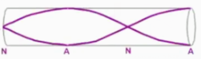
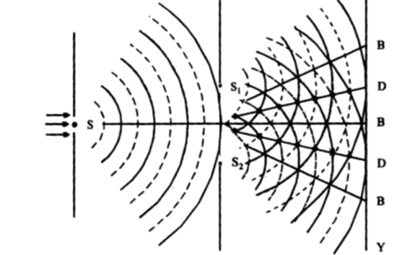

# Electricity

`Electromotive force` (`EMF`): Energy transferred from source per unit charge.

## Electric field

`Electric field strength`: **Force per positive charge**

## DC Circuits

#### Kirchhoff's laws
\[ˈkɜrkhɔf\]

`Kirchhoff's 1st law`: Sum of currents into a junction
IS EQUAL TO
Sum of currents out of junction
> Kirchhoff’s 1st law is another statement of the law of
conservation of charge

`Kirchhoff's 2nd law`: Sum of e.m.f.s in a closed circuit
IS EQUAL TO
Sum of potential differences

> Kirchhoff’s 2nd law is another statement of the law of
conservation of energy

#### Newton's laws

`Newton's 1st law`: **If a body is at rest it remains at rest or if it is in
motion it moves with a uniform velocity until it is acted
on by resultant force or torque**

`Newton's 2nd law`: **The rate of change of momentum of a body
is proportional to the resultant force and occurs in the
direction of force**

`Newton's 3rd law`: **if a body A exerts a force on a body B, then
body B exerts an equal but opposite force on body A,
forming an action-reaction pair**

# Force
`Force`: **The rate of change of momentum of a body**

#### Deriving a formula for current

**`I = Anvq`**  
where
- `A`: cross-sectional area
- `n`: no. of electrons per unit volume
- `v`: average **drift velocity**

# Momentum

#### Use the kinetic model to explain the pressure exerted by gases. \[3\] s15/22 Q4
- Molecules collide with the wall and there is a change in momentum.
- Change in momentum is force.
- Many of molecular collisions over area provides pressure.

## Collision
#### Elastic collision
> Relative speed maintains constant before and after elastic collision
> K.E. is always conserved

# Atoms

`Isotope`: **Nuclei** having the same no. of protons \[1\] but different number of neutrons \[1\]

# Fundamental particles

The `Standard model`: classifies matter into `quarks`, `leptons` and `force carriers`.

# Magnetic fields

- `Magnetic flux density`: Force per unit length of unit current

# Misc

### Distance from earth to sun
1.5 EXP 11 meters

# Radioactivity

## Rutherford's experiment

| Appearance                                                                | Inference                                                                     |
|:--------------------------------------------------------------------------|:------------------------------------------------------------------------------|
| <u> **A few** α-particles were deviated through **angles > 90°**</u>  | <u>Nucleus is charged and containing the majority of the mass of the atom</u> |
| <u> **Most** α-particles were deviated through small angles < 10°</u> | <u>The nucleus is very small **in comparison to the atom**</u>                |

#### Why Apparatus enclosed in a vacuum \[1\]
**α-particle travels short distance in air**

#### Why β-particle inappropriate for this experiment \[2\]
- a range of energies
- very small mass
- can be deviated by orbital electrons

#### Whether isotopes of gold would give rise to different deviations of a particular alpha-particle \[2\]
- Deviation depends on the charge on the nucleus
- They have the same charge so as to experience same deviation

## Decay

**Radioactive decay** \[2\]: Nucleus emits α-particles or β-particles or γ-radiation \[1\] <u>to form a different nucleus</u> \[1\]

**Spontaneous decay** \[2\]: The rate of decay is not affected by external factors \[1\], like temperature or pressure \[1\]  
**Random decay**: \[1\]: Time of decay con't be predicted / The count rate from a radioactive source fluctuates

#### β- decay
`n -> p + β- + anti-neutrino`  
`udd -> uud + β- + anti-neutrino`

#### β+ decay
`p -> n + β+ + neutrino`  
`uud -> udd + β+ + neutrino`

#### Why α-particle lose energy traveling through air
**Collision with molecules**\[1\] **causes ionisation**\[1\]

#### Properties of β-radiation \[2\]
- negatively charged
- speed up to 0.99c
- can be absorbed by 1-4mm of aluminum, or 0.5-2m for ranges in air

# Waves

## Basic terms

`Transverse wave`: vibration is perpendicular to wave movemtent

## Electromagnetic Waves
`v = 3 * 10^8 m/s`

`λ` = 

## Waves in tubes

n=1, 1st harmonic  
n=...

### One open
  


### Two open
  


## `Interference` and `Coherence`
// `Interference`: the formation of points of cancellation and reinforcement where 2 coherent waves pass each other

`Coherence`: waves having a constant phase difference

`In phase`: 0° / 360° in phase diff
`Out of phase`: 180° in phase diff **only**


## Double-slit Interference
  

```
Where  
    a = slit separation  
    D = distance from slit to screen  
    x = fringe width
```

## Diffraction Grating
  
`d sin θ = nλ`
```
Where d = distance between successive slits
        = reciprocal of number of lines per meter
      θ = angle from horizontal equilibrium
      n = order number
      λ = wavelength
```