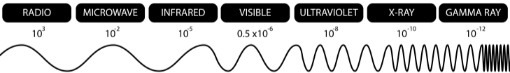

# Waves

## Basic terms

`Transverse wave`: vibration is perpendicular to wave movemtent

## Electromagnetic Waves
`v = 3 * 10^8 m/s`

`λ` = 

## Waves in tubes

n=1, 1st harmonic  
n=...

### One open
  

### Two open
  
