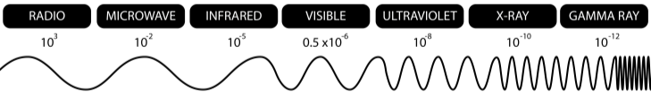
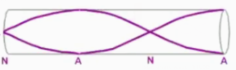
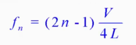
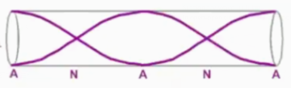
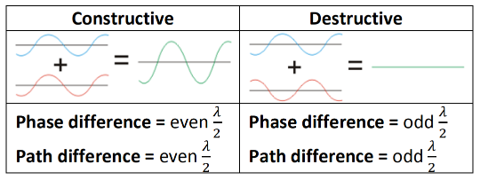
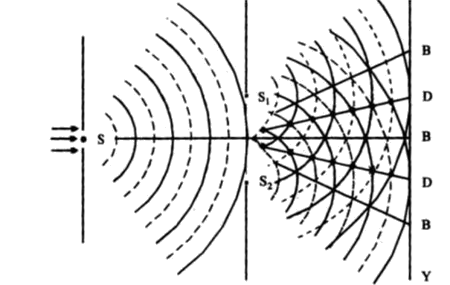
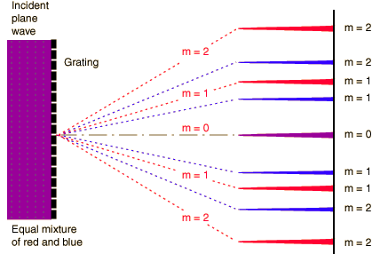

# Waves

## Basic terms

`Transverse wave`: vibration is perpendicular to wave movemtent

## Electromagnetic Waves
`v = 3 * 10^8 m/s`

`λ` = 

## Waves in tubes

n=1, 1st harmonic  
n=...

### One open
  


### Two open
  


## `Interference` and `Coherence`
// `Interference`: the formation of points of cancellation and reinforcement where 2 coherent waves pass each other

`Coherence`: waves having a constant phase difference

`In phase`: 0° / 360° in phase diff
`Out of phase`: 180° in phase diff **only**



## Double-Slit Interference

```
Where  
    a = split separation  
    D = distance from slit to screen  
    x = fringe width
```

## Diffraction Grating

`d sin θ = nλ`
```
Where d = distance between successive slits
        = reciprocal of number of lines per meter
      θ = angle from horizontal equilibrium
      n = order number
      λ = wavelength
```